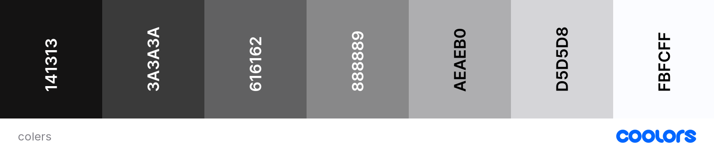
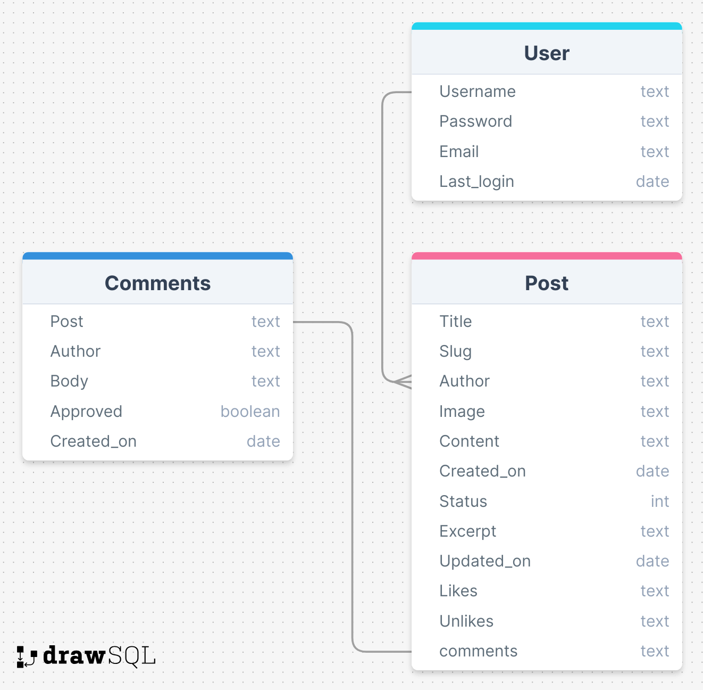
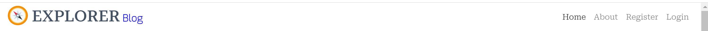
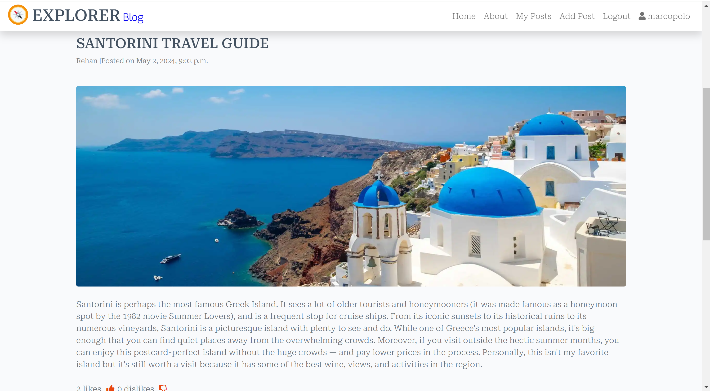

# The Explorer blog

The Explorer Blog App is a web application designed for travel enthusiasts to share their travel experiences, photos, and tips with a community of like-minded adventurers. Users can create and manage their own travel blogs, read and comment on posts from others, and discover new travel destinations. The app provides a platform for users to engage with each other's content through likes and comments, fostering a vibrant and interactive travel community.

The live link can be found here - [The Explorer Blog](https://explorer-blog-530c0b1471ba.herokuapp.com/)

# Table of Content

- [The Explorer Blog](#the-explorer-blog)
  * [User Experience (UX)](#user-experience-ux)
    + [User Stories](#user-stories)
    + [Design](#design)
      - [Colour Scheme](#colour-scheme)
      - [Imagery](#imagery)
      - [Fonts](#fonts)
      - [Wireframes](#wireframes)
  * [Agile Methodology](#agile-methodology)
  * [Data Model](#data-model)
  * [Testing](#testing)
  * [Security Features and Defensive Design](#security-features-and-defensive-design)
    + [User Authentication](#user-authentication)
    + [Form Validation](#form-validation)
    + [Database Security](#database-security)
  * [Features](#features)
    + [Header](#header)
    + [Footer](#footer)
    + [Home Page](#home-page)
    + [User Account Pages](#user-account-pages)
    + [Browse Posts](#browse-posts)
    + [Post Detail Page](#post-detail-page)
    + [Add Post Form](#add-post-form)
    + [Update Post Form](#update-post-form)
    + [Delete Post](#delete-post)
    + [Comment Post Form](#comment-post-form)
    + [Error Pages](#error-pages)
    + [Future Features](#future-features)
  * [Deployment - Heroku](#deployment---heroku)
  * [Forking this repository](#forking-this-repository)
  * [Cloning this repository](#cloning-this-repository)
  * [Languages](#languages)
  * [Frameworks - Libraries - Programs Used](#frameworks---libraries---programs-used)
  * [Credits](#credits)
  * [Acknowledgments](#acknowledgments)
 
<small><i><a href='http://ecotrust-canada.github.io/markdown-toc/'>Table of contents generated with markdown-toc</a></i></small>
## User Experience (UX)
Creating a delightful and intuitive user experience for a travel blog app is essential
to engage users and encourage them to share and explore travel content. Here are some 
key UX principles and features that should be incorporated into the app to enhance 
user satisfaction:

### User Stories

#### View paginated list of posts
- As a site user I can view a paginated list of posts so that I can select which post I want to view
- Acceptance criteria
- Given more than one post in the database, these multiple posts are listed.
- When a user opens the main page a list of posts is seen.
  Then the user sees all post titles with pagination to choose what to read.
#### User Navigation
- As a Site User I can immediately understand the purpose of the site so that I can decide if it meets my needs.
- As a Site User, I can intuitively navigate around the site so that I can find content and understand where I am on the site.
- As a Site User, I can view a paginated list of posts so that I can select a post to view.
- As a Site User, I can click on a post so that I can read the full post, view comments left by users.

#### Post Management
- As a Site User, I can add my  post onto the app through an easy to use interface so that I can share them with other users.
- As a Site User, I can edit and delete my posts that I have created so that I can easily make changes without having to start over.

#### Post Interaction
- As a Site User, I can comment on other people's posts so I can give my feedback.
- As a Site User, I can edit and delete comments that I have created so that I can easily make changes if I have made a mistake.
- As a Site User / Admin I can view comments on an individual post so that I can read the conversation

#### Account registration
- As a Site User, i can register an account by giving a user name or email and password.
- As a Site User, I can log in to the app.
- As a Site User, I can  logged in then i can comment on posts, like or unlike the posts and creat my own posts to share with other Users.
- As a Site User, I can Add a new Post so that so that i can share my experience with other users

#### Site Administration
- As a Site Administrator, I can create, read, update and delete posts so that I can manage my blog content.
- As a Site Administrator, i have Given a logged in user, they can create a blog post.
- As a Site Administrator, i have Given a logged in user, they can read a blog post.
- As a Site Administrator, i have Given a logged in user, they can update their blog post.
- As a Site Administrator, i have Given a logged in user, they can delete a blog post.
- As a Site Administrator, I can create or update the about page content so that it is available on the site.
- As a Site Administrator, I can approve or disapprove comments so that I can filter out objectionable comments.
- As a Site Administrator, I can create or update the about page content so that it is available on the site.
- As a Site Administrator, I can create draft posts so that I can finish writing the content later.

#### Read about the site
- As a Site User, I can click on the About link so that I can read about the site.
- As a Site Administrator, I can create or update the about page content so that it is available on the site.

#### Potential Collaboration
- As a Site User, I can fill in a contact form so that I can submit a request for collaboration.
- As a Site Administrator, I can store collaboration requests in the database so that I can review them.
- As a Site Administrator, i can read the collaboration requests and reply to them for further collaboration.

#### User stories not yet implemented

The following user stories were scoped out of the project due to time constraints. It is intended that these user stories will be implemented at a later date. 

- As a Site User, I can bookmark a posts so that i can view my favorite posts later.
- As a Site User, I can share the posts to the outher socialmedia platforms. 
- As a Site User, I can search and filter posts so that I can find the one I want.

[Back to top](<#table-of-content>)

### Design

The site has a very simple and clean design which was purposely chosen in order to keep in theme with the site's goal. i.e. invoking a sense of calm in the user and reducing stress. 

#### Colour Scheme
Colour palette from Coolors

The colour scheme of the site is mainly pale white , Blue and green . The colours chosen are quite neutral and calming. 

Great care was taken to establish a good contrast between background colours and text at all times to ensure maximum user accessibility. 

#### Imagery
The mostely images are from user posts , uploaded to cloudinary DB. logo and main Banner and i have created myself.
#### Fonts
The Georgia serif and Roboto Slab serif font is the main font used for the body of the website with the Playfair Display font used for the main headings on the home page. These fonts were imported via Google Fonts. Sans Serif is the backup font, in case for any reason the main font isn't being imported into the site correctly.

#### Wireframes

 
Landing Page

 Posts Pages

Add Post

About Page

Registration Page

Login&Logout page

 

[Back to top](<#table-of-content>)

## Agile Methodology

Github projects was used to manage the development process using an agile approach. Please see link to project board [here](https://github.com/users/Marcopolo1975/projects/6/views/1)

The 16 user stories were documented within the Github project as Milestones. A Github Issue was created for each User Story which was then allocated to a milestone. Each User Story has defined acceptance criteria to make it clear when the User Story has been completed. The acceptance criteria are further broken down into tasks to facilitate the User Story's execution.

## Data Model
I used principles of Object-Oriented Programming throughout this project and Django’s Class-Based Generic Views.  

Django AllAuth was used for the user authentication system.

In order for the users to create Post a custom Post model was required. The Post author is a foreign key to the User model given a post can only have one author.

The Comment model allows users to comment on individual Post and the Post is a foreign key in the comment model given a comment can only be linked to one Post. 

The diagram below details the database schema.

[Back to top](<#table-of-content>)
## Testing

## Code Validation
The code on the 'Explorer blog' site has been tested through W3C Markup Validation Service, W3C CSS Validation Service and JSHint. Errors were at first found on the site in the W3C Markup Validation Service but could quite easily be fixed.

### Markup Validation
After fixing the inital errors that W3C Markup Validation Service reported, no errors were returned.

<b>HTML Validation Result</b>

 

### CSS Validaton
When validating my own code the W3C CSS Validator reports no errors.

<b>CSS Validation Result</b>

 

### PEP Validation

All Python files were run through Pep8 with no errors found.

### Responsiveness Test
The responsive design tests were carried out manually with [Google Chrome DevTools](https://developer.chrome.com/docs/devtools/) and [Responsive Design Checker](https://techsini.com/multi-mockup/index.php).

| Desktop    | Display <1280px       | Display >1280px    |
|------------|-----------------------|--------------------|
| Render     | pass                  | pass               |
| Images     | pass                  | pass               |
| Links      | pass                  | pass               |

| Tablet     | Samsung Galaxy Tab 10 | Amazon Kindle Fire | iPad Mini | iPad Pro |
|------------|-----------------------|--------------------|-----------|----------|
| Render     | pass                  | pass               | pass      | pass     |
| Images     | pass                  | pass               | pass      | pass     |
| Links      | pass                  | pass               | pass      | pass     |

| Phone      | Galaxy S5/S6/S7       | iPhone 6/7/8       | iPhone 12pro         |
|------------|-----------------------|--------------------|----------------------|
| Render     | pass                  | pass               | pass      | pass     |
| Images     | pass                  | pass               | pass      | pass     |
| Links      | pass                  | pass               | pass      | pass     |

[Back to top](<#table-of-content>)

### Browser Compatibility
* Google Chrome Version (106.0.5249.119)
* Mozilla Firefox (version 105.0.3)
* Min (version 1.26.0)
* Apple Safari (version 16.0)
* Microsoft Edge (version 106.0.1370.47)

## Security Features and Defensive Design

### User Authentication

- Django's user authentication is used to make sure that any requests to access secure pages by non-authenticated users are redirected to the login page. 
- Django's UserPassesTest is used to limit access based on certain permissions i.e. to ensure users can only edit/delete posts and comments for which they are the author. If the user doesn't pass the test they are shown an HTTP 403 Forbidden error.

### Form Validation
If incorrect or empty data is added to a form, the form won't submit and a warning will appear to the user informing them what field raised the error. 

### Database Security
The database url and secret key are stored in the env.py file to prevent unwanted connections to the database and this was set up before the first push to Github.

Cross-Site Request Forgery (CSRF) tokens were used on all forms throughout this site.

### Custom error pages:

Custom Error Pages were created to give the user more information on the error and to provide them with buttons to guide them back to the site.

- 400 Bad Request - The Easy Eater is unable to handle this request.
- 403 Page Forbidden - Looks like you're trying to access forbidden content. Please log out and sign in to the correct account.
- 404 Page Not Found - The page you're looking for doesn't exist.
- 500 Server Error - The Easy Eater is currently unable to handle this request

[Back to top](<#table-of-content>)

## Features

### Header

**Logo**

- A customised logo was created using Photoshop.
- This logo is positioned in the top left of the navigation bar. The logo is linked to the home page for ease of navigation for the user.

**Navigation Bar**

- The navigation bar is present at the top of every page and includes all links to the various other pages.
- The  navigation link is a drop down menu which includes the Sign up and Log in links. 

- The options to Sign up or Log in will change to the option to log out once a user has logged in.
- The navigation bar is fully responsive, collapsing into a hamburger menu when the screen size becomes too small.
- Hovering over the links will lighten the font.

### Footer

- The footer section includes links to Facebook, Instagram, Twitter and Youtube.
- Clicking the links in the footer opens a separate browser tab to avoid pulling the user away from the site.

### Home Page

- The home page includes an attractive banner section which encourages the user to sign up to the site with the message "let's discover the world!" and an image of famous Travel destinations.
- The navbar includes a sign up button which takes the user to the sign up page.

**About Section**

- The About  section gives a brief overview of what the site. and introduction of the  site owner  and goals of the site.

### User Account Pages

**Sign Up**

**Log In**

**Log Out**

- Django allauth was installed and used to create the Sign up, Log in and Log out functionality. 
- Success messages inform the user if they have logged in/ logged out successfully.

###  Posts Pages

 

- The landing  page displays 6 Posts with images and title and few lines of details. with a status of published with the most recent posts displayed first.
- The Post cards are paginated after every 6 Posts. 
- Each card displays the Post image, Title and Author name and created date. 
- Clicking anywhere inside the post card or Read more button will take you directly to that posts's detailed page.

### Post Detail Page

- The Post header section at the top of the page shows the Post image, title, author, create date and time.
- Post details a located right below the post image
- below the post details there are delete button and edit button are located.
- the poast owner can edit or delete his post.
- below the post details there are thumbs up and thumbs down buttons, use can like or dislike a psot.
- Edit Post Button - Clicking the button opens the update Post form prepopulated with the current Post details.
- Delete Post Button - Clicking the button opens the confirm delete Post page. 

**Comments Section**

- The comments section lists all comments left by users for that particular Post.
- Comments can only be left if a user is logged in. Any comments left by the user that is currently signed in can be updated or deleted using the buttons in the comments page.     
- The user receives a success message notifying them that the comment has been successfully added, updated or deleted.
- The user cant delete or edit other users commnets, user must login to edit or delete his comment.

### Add Post Form

  

- If the user is logged in, then they can add a Post by clicking the link on the navigation bar.
- The form fields for 'title' and 'image' detail text and excerpt, fields.
- The user can upload a photo if they wish. If they choose not to, a default image displays as their Post image.
- Failing to fill out the Post Title, Description, details,  results in the form failing and rendering a message stating which fields you have missed.
- The user cannot add a post without logging in.
- The user will receive a success message notifying them that the has been successfully created.

### Update Post Form

  

- If the user is logged in and is the author or the Post they can choose to edit the Post by clicking the edit button on the Post detail page. 
- The form opens with all fields populated with the original content.
- the Edit and delete buttons are not displayed if the user is not Author of the post-
- The user will receive a success message notifying them that the Post has been successfully updated.

### Delete Post

  

- If the user is logged in and is the author or the post they can choose to delete the Post by clicking the delete button on the Post detail page.  
- The user is asked to confirm if they wish to delete the Post or cancel.
- The user will receive a success message notifying them that the Post has been successfully deleted.

### Like or dislike Post 

- Below the post details there are 2 buttons located in thumbs-up and thumb-down form.
- The user can like or dislike the Post, the number of likes or dislikes are displayed near buttons.

### Error Pages

Custom Error Pages were created to give the user more information on the error and to guide them back to the site.

- 400 Bad Request - The Easy Eater is unable to handle this request.
- 403 Page Forbidden - Looks like you're trying to access forbidden content. Please log out and sign in to the correct account.
- 404 Page Not Found - The page you're looking for doesn't exist.
- 500 Server Error - The Easy Eater is currently unable to handle this request

### Future Features
The following user stories were scoped out of the project due to time constraints. It is intended that these user stories will be implemented at a later date. 

The following user stories were scoped out of the project due to time constraints. It is intended that these user stories will be implemented at a later date. 

- As a Site User, I can bookmark a posts so that i can view my favorite posts later.
- As a Site User, I can share the posts to the outher socialmedia platforms. 
- As a Site User, I can search and filter posts so that I can find the one I want.

[Back to top](<#table-of-content>)

## Deployment - Heroku

To deploy this page to Heroku from its GitHub repository, the following steps were taken:

### Create the Heroku App:
- Log in to [Heroku](https://dashboard.heroku.com/apps) or create an account.
- On the main page click the button labelled New in the top right corner and from the drop-down menu select "Create New App".
- Enter a unique and meaningful app name.
- Next select your region.
- Click on the Create App button.

### Attach the Postgres database:
- In the Resources tab, under add-ons, type in Postgres and select the Heroku Postgres option.
- Copy the DATABASE_URL located in Config Vars in the Settings Tab.

### Prepare the environment and settings.py file:
- In your GitPod workspace, create an env.py file in the main directory.
- Add the DATABASE_URL value and your chosen SECRET_KEY value to the env.py file. 
- Update the settings.py file to import the env.py file and add the SECRETKEY and DATABASE_URL file paths.
- Comment out the default database configuration.
- Save files and make migrations.
- Add Cloudinary URL to env.py
- Add the cloudinary libraries to the list of installed apps.
- Add the STATIC files settings - the url, storage path, directory path, root path, media url and default file storage path.
- Link the file to the templates directory in Heroku.
- Change the templates directory to TEMPLATES_DIR
- Add Heroku to the ALLOWED_HOSTS list the format ['app_name.heroku.com', 'localhost']

### Create files / directories
- Create requirements.txt file
- Create three directories in the main directory; media, storage and templates.
- Create a file named "Procfile" in the main directory and add the following: web: gunicorn project-name.wsgi

### Update Heroku Config Vars
Add the following Config Vars in Heroku:
- SECRET_KEY value 
- CLOUDINARY_URL
- PORT = 8000
- DISABLE_COLLECTSTATIC = 1

### Deploy
- NB: Ensure in Django settings, DEBUG is False
- Go to the deploy tab on Heroku and connect to GitHub, then to the required repository. 
- Scroll to the bottom of the deploy page and either click Enable Automatic Deploys for automatic deploys or Deploy Branch to deploy manually. Manually deployed branches will need re-deploying each time the repo is updated.
- Click View to view the deployed site.

[Back to top](<#table-of-content>)

The site is now live and operational.
## Forking this repository
- Locate the repository at this link [The Explorer Blog]().
- At the top of the repository, on the right side of the page, select "Fork" from the buttons available. 
- A copy of the repository is now created.

## Cloning this repository
To clone this repository follow the below steps: 

1. Locate the repository at this link [The Explorer Blog](). 
2. Under **'Code'**, see the different cloning options, HTTPS, SSH, and GitHub CLI. Click the prefered cloning option, and then copy the link provided. 
3. Open **Terminal**.
4. In Terminal, change the current working directory to the desired location of the cloned directory.
5. Type **'git clone'**, and then paste the URL copied from GitHub earlier. 
6. Type **'Enter'** to create the local clone.

## Languages

- Python
- HTML
- CSS
- Javascript

## Frameworks - Libraries - Programs Used
- [Django](https://www.djangoproject.com/): Main python framework used in the development of this project
- [Django-allauth](https://django-allauth.readthedocs.io/en/latest/installation.html): authentication library used to create the user accounts
- [PostgreSQL](https://www.postgresql.org/) was used as the database for this project.
- [Heroku](https://dashboard.heroku.com/login) - was used as the cloud based platform to deploy the site on.
- [Responsinator](http://www.responsinator.com/) - Used to verify responsiveness of website on different devices.
- [Balsamiq](https://balsamiq.com/) - Used to generate Wireframe images.
- [Chrome Dev Tools](https://developer.chrome.com/docs/devtools/) - Used for overall development and tweaking, including testing responsiveness and performance.
- [Font Awesome](https://fontawesome.com/) - Used for icons in information bar.
- [GitHub](https://github.com/) - Used for version control and agile tool.
- [Google Fonts](https://fonts.google.com/) - Used to import and alter fonts on the page.
- [W3C](https://www.w3.org/) - Used for HTML & CSS Validation.
- [PEP8 Online](http://pep8online.com/) - used to validate all the Python code
- [Jshint](https://jshint.com/) - used to validate javascript
- [Coolors](https://coolors.co/) - Used to create colour palette.
- [Favicon](https://favicon.io/) - Used to create the favicon.
- [Lucidchart](https://lucid.app/documents#/dashboard) - used to create the database schema design
- [Grammerly](https://app.grammarly.com/) - used to proof read the README.md
- [Summernote](https://summernote.org/): A WYSIWYG editor to allow users to edit their posts
- [Techsini](https://techsini.com/multi-mockup/index.php) - Site mockup generator
- [Crispy Forms](https://django-crispy-forms.readthedocs.io/en/latest/) used to manage Django Forms
- [Cloudinary](https://cloudinary.com/): the image hosting service used to upload images
- [Bootstrap 4.6](https://getbootstrap.com/docs/4.6/getting-started/introduction/): CSS Framework for developing responsiveness and styling
- [Hatchful](https://hatchful.shopify.com/): Used to generate custom logo
- [Tables Generator](https://www.tablesgenerator.com/markdown_tables): Used to convert excel testing tables to markdown

## Credits

- [W3Schools](https://www.w3schools.com/)
- [Django Docs](https://docs.djangoproject.com/en/4.0/)
- [Bootstrap 4.6 Docs](https://getbootstrap.com/docs/4.6/getting-started/introduction/)
- [Stack Overflow](https://stackoverflow.com/)
- [Pexels](https://www.pexels.com/): All imagery on the site was sourced from Pexels.com
- [Update View](https://pytutorial.com/django-updateview-example)
- [Pagination](https://docs.djangoproject.com/en/2.2/topics/pagination/#using-paginator-in-a-view)
- [AutoSlugField](https://django-extensions.readthedocs.io/en/latest/field_extensions.html)
- [Code Institute - Blog Walkthrough Project](https://github.com/Code-Institute-Solutions/Django3blog)

[Back to top](<#table-of-content>)

## Acknowledgments

Many thanks to my mentor Antonio for his support and advice throughout my Course spacialy for creating portfolio projects. 
Thanks to The Code Institute slack community for their quick responses and very helpful feedback in particular Ian Meigh.

