# Table of Contents
- [User Story Testing](#user-story-testing)
- [Validator Testing](#validator-testing)
  * [HTML](#html)
    + [Fixed Errors](#fixed-errors)
    + [Unfixed Errors](#unfixed-errors)
  * [CSS Validaton](#css-validaton)
  * [Javascript](#javascript)
  * [Python](#python)
  * [Pagespeed insights](#pagespeed-insights)
- [Browser Testing](#browser-testing)
- [Device Testing](#device-testing)
- [Manual Testing](#manual-testing)
  * [Site Navigation](#site-navigation)
  * [Posts Page](#posts-page)
  * [Post Detail Page](#post-detail-page)
  * [Add Post Page](#add-Post-page)
  * [Update Post Page](#update-Post-page)
  * [Confirm Delete Post Page](#confirm-delete-Post-page)
  * [My Posts Page](#my-Posts-page)
  * [Django All Auth Pages](#django-all-auth-pages)
- [Bugs](#bugs)
  * [Fixed Bugs](#fixed-bugs)
    + [Required fields using Summernote extension submit with just whitespace entered](#required-fields-using-summernote-extension-submit-with-just-whitespace-entered)
    + [No Reverse Match Error](#no-reverse-match-error)
    + [Cloudinary Images not Displaying](#cloudinary-images-not-displaying)
    + [Footer not staying at bottom of screen](#footer-not-staying-at-bottom-of-screen)
  * [Unfixed bugs:](#unfixed-bugs-)

<small><i><a href='http://ecotrust-canada.github.io/markdown-toc/'>Table of contents generated with markdown-toc</a></i></small>

## User Story Testing

### EPIC | User Profile
*As a Site User I can register an account so that I can add/edit/delete my Posts and comment on and like or dislike other people's Posts and add Posts to my Explorer Blog.*

- A registration up button is immediately visible on the navigation Bar for the user to sign up to get started. When the user clicks the button they are taken to the sign up page.

- Once the user has registered an account they can perform all the actions listed above.

*As a Site User, I can login or logout of my account so that I can keep my account secure.*
- If the user has registered an account they can access the login and logout buttons in the My Account section of the Navbar. 

*As a Site User I can see my login status so that I know if I'm logged in or out.*
- Once the user has logged into their account their username displays on the Navbar beside a profile icon.

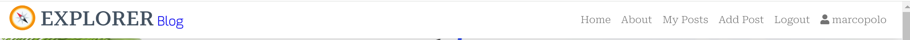

### EPIC | User Navigation
 *As a User I can immediately understand the purpose of the site so that I can decide if it meets my needs*

*As a user, I can intuitively navigate around the site so that I can find content*
- A navigation bar is visible on every page of the site which is fully responsive on different screen sizes.

*As a Site User, I can view a paginated list of Posts so that I can select a Post to view.*
- The Browse Posts page displays a paginated list of all Posts in the database with a status of published. 

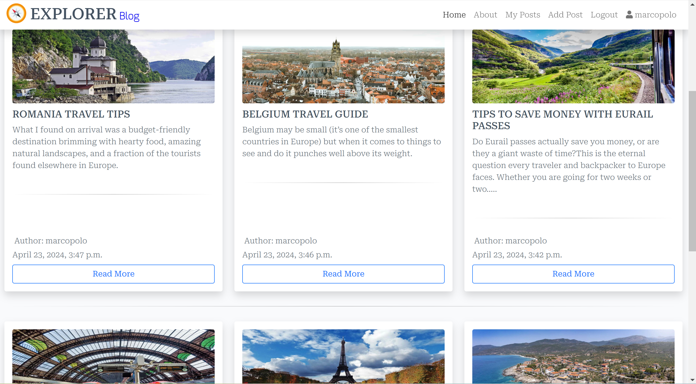

*As a Site User, I can click on a post so that I can read the full Post, and view comments left by users.*
- Clicking anywhere inside the Post card will take you directly to that Post's detailed page which displays the full Post details. 

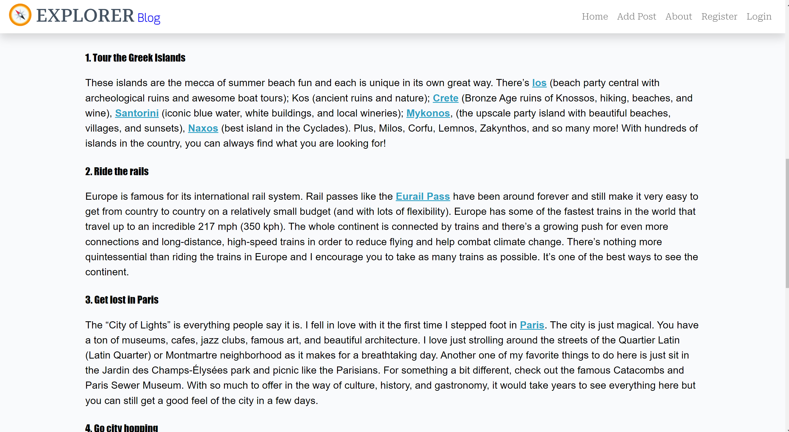

- A list of comments is displayed underneath the Post details.

- Like or dislike icons are displayed underneath the Post details.

### EPIC | Post Management
*As a Site User, I can view the posts and write a comment on Posts and like or dislike the Posts onto the app through an easy to use interface so that I can share my opinion  with other users.*
- Once the user has logged in, an Add Post Option is immediately available on the Navbar as a call to action for the user to add a Post. When the user clicks the button they are taken to the add Post form.

- The 'Add Post' button on the Nav bar is visible on every page.

- Once the user has filled out the form details they can choose to 'Submit Button' which adds the Post to the Posts page.

*As a Site User, I can edit and delete my  Posts that I have created so that I can easily make changes without having to start over.*
- If the logged in user is the Post author, edit and delete Post icon buttons will display on the Post detail page for each Post allowing the user to edit and delete their Posts.

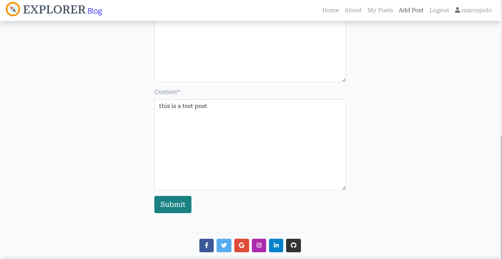

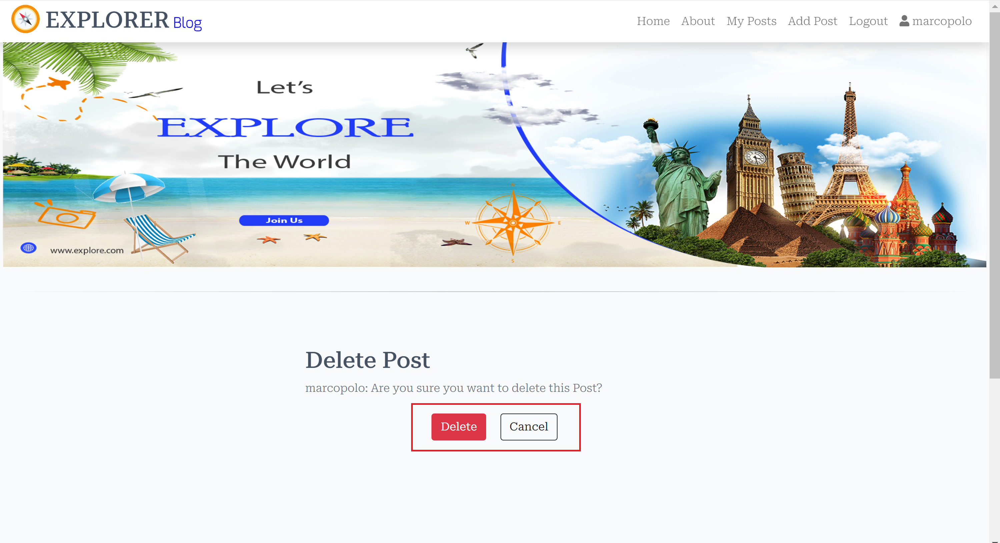

*As a Site User, I can view my Posts so that I can see and manage all Posts I have created in the one location.*
- All the user's created Posts are available to see on the 'My Posts' page.

### EPIC | Post Interaction
*As a Site User, I can like or dislike  users' Posts, so can show my view about the Post.
- Each Post has like or dislike buttons right below the Post details, it show also number of likes or dislikes.

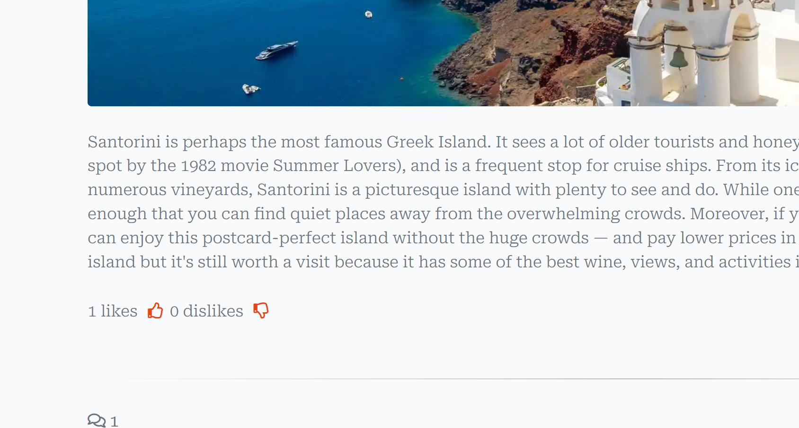

*As a Site User, I can comment on other people's Posts so I can give my feedback.*
- Each Post has a comment section where logged in users can leave comments on the Post.

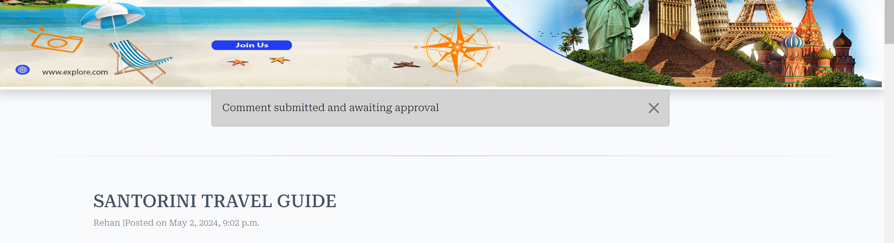

### EPIC | Posts Management
*As a Site User, I can edit and delete comments that I have created so that I can easily make changes if I have made a mistake.*
- If the logged in user is the comment author, edit and delete icon buttons will display bellow the comment  allowing the user to edit or delete their comments.

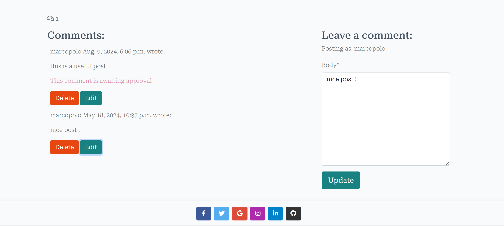

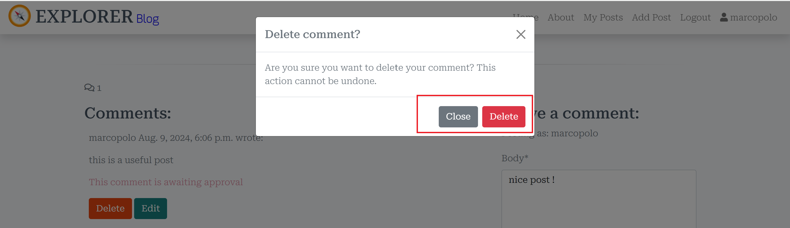

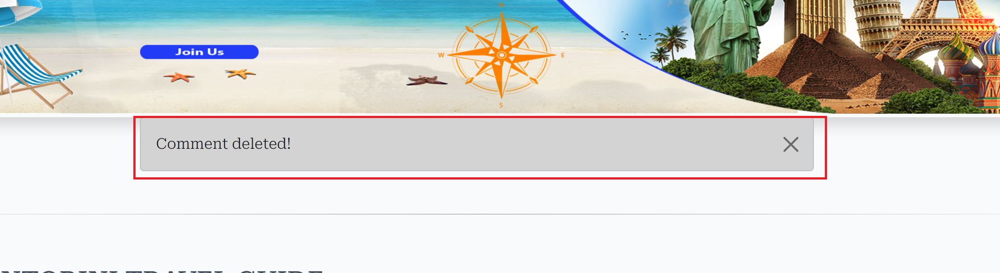

### EPIC | Site Administration
*As a Site Administrator, I can create, read, update and delete Posts, and comments so that I can manage the app content*
-  Admins have full access to CRUD functionality for all Posts,and comments in the admin panel.

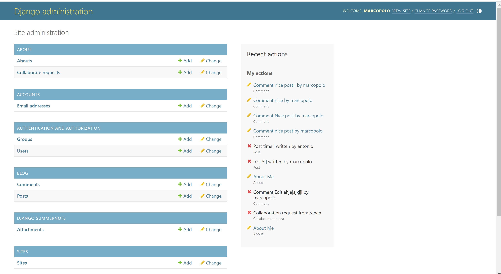
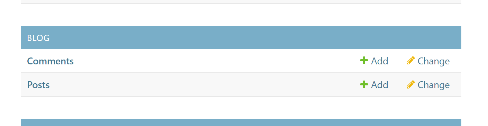

[Back to top](<#table-of-contents>)
## Validator Testing

## Code Validation
The code on the 'Explorer blog' site has been tested through W3C Markup Validation Service, W3C CSS Validation Service and JSHint. Errors were at first found on the site in the W3C Markup Validation Service but could quite easily be fixed.

### Markup Validation
After fixing the inital errors that W3C Markup Validation Service reported, no errors were returned.

### HTML
### Html Validation

<b>HTML Validation Result</b>

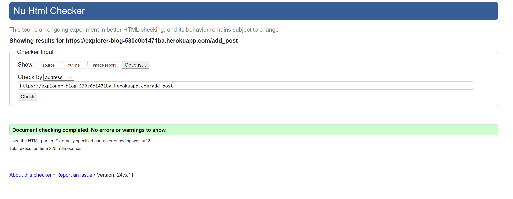

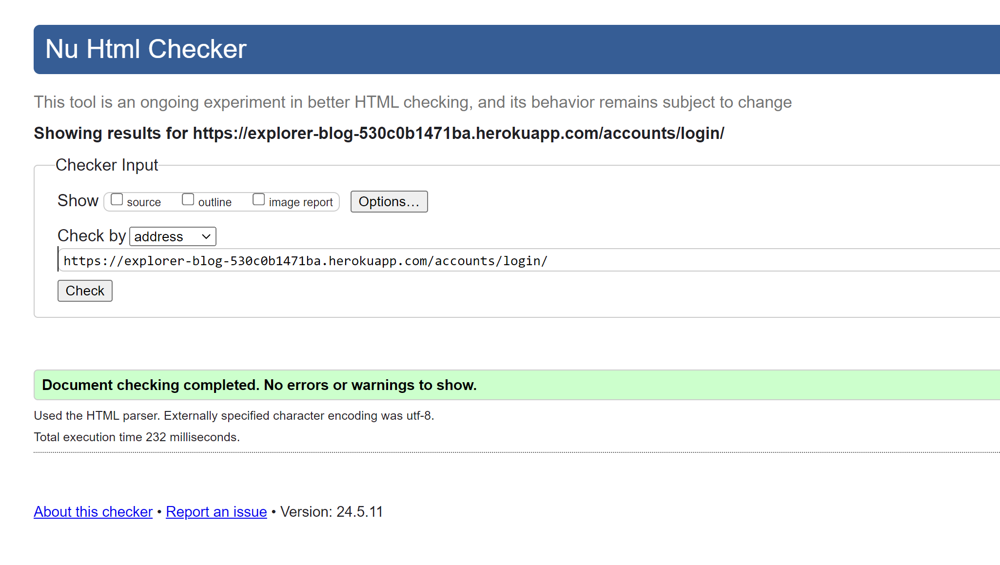

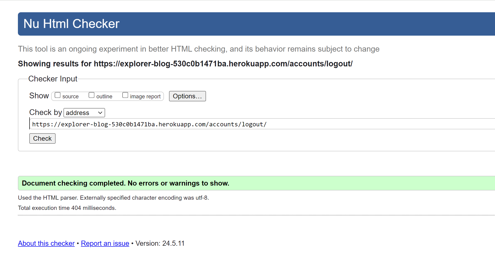

 

### Summernote Errors
When validating the About Page I received a number of errors which were caused by the installed Summernote library which runs when using the form on these pages. I could not rectify these errors given that they weren't in my own code therefore they are unresolved. 

 

 
Summernote Errors

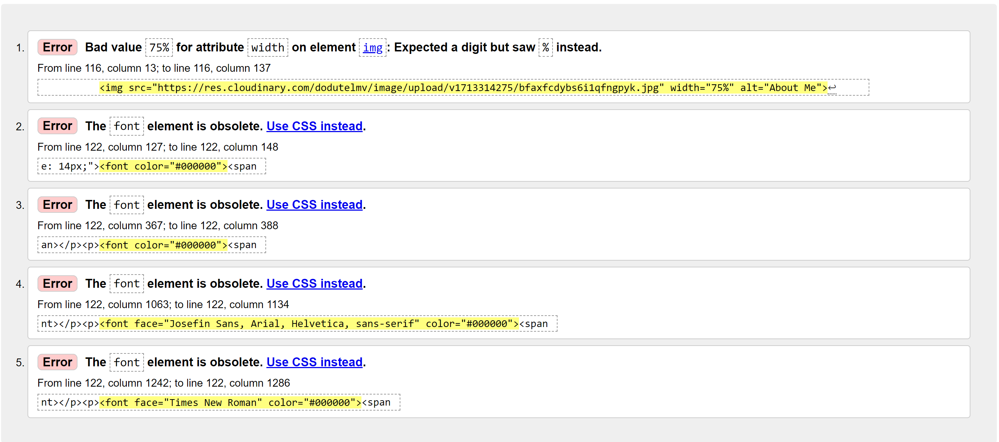
 

### CSS Validaton
When validating my own code the W3C CSS Validator reports no errors.

<b>CSS Validation Result</b>

 

### Python
### PEP Validation

All Python files were run through Pep8 with no errors found.
[Back to top](<#table-of-contents>)

### Responsiveness Test
The responsive design tests were carried out manually with [Google Chrome DevTools](https://developer.chrome.com/docs/devtools/) and [Responsive Design Checker](https://techsini.com/multi-mockup/index.php).

| Desktop    | Display <1280px       | Display >1280px    |
|------------|-----------------------|--------------------|
| Render     | pass                  | pass               |
| Images     | pass                  | pass               |
| Links      | pass                  | pass               |

### Device Testing
| Tablet     | Samsung Galaxy Tab 10 | Amazon Kindle Fire | iPad Mini | iPad Pro |
|------------|-----------------------|--------------------|-----------|----------|
| Render     | pass                  | pass               | pass      | pass     |
| Images     | pass                  | pass               | pass      | pass     |
| Links      | pass                  | pass               | pass      | pass     |

| Phone      | Galaxy S5/S6/S7       | iPhone 6/7/8       | iPhone 12pro         |
|------------|-----------------------|--------------------|----------------------|
| Render     | pass                  | pass               | pass      | pass     |
| Images     | pass                  | pass               | pass      | pass     |
| Links      | pass                  | pass               | pass      | pass     |

### Pagespeed insights
Google Pagespeed insights Chrome Developer Tools was used to test the application within the areas of *Performance*, *Accessibility*, *Best Practices* and *SEO*. I tested the 
* Overall site performance for desktop - Performance: 99, Accessibility: 91, Best Practises: 96, SEO: 91
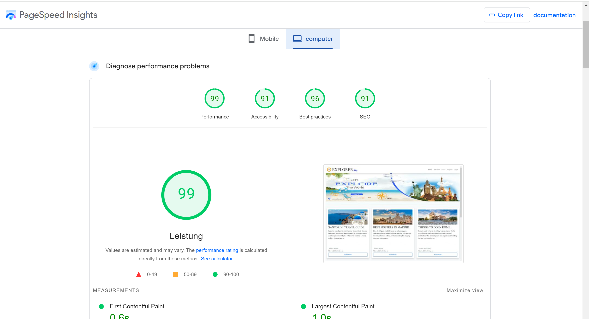
* Overall site performance for mobiles - Performance: 80, Accessibility: 92, Best Practises: 96, SEO: 91
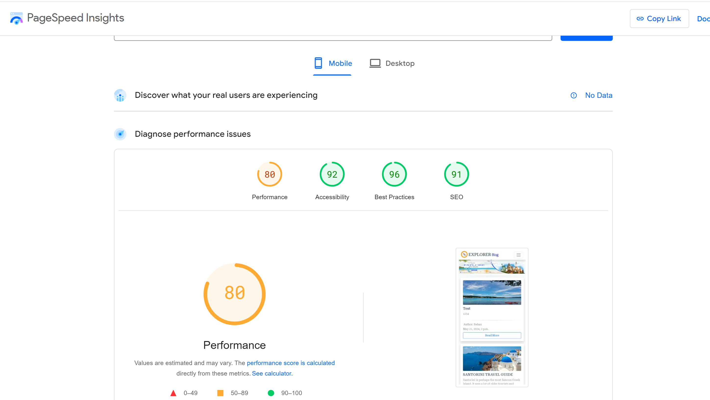

In general this is OK results. The performance is affected in a negative way by external scripts (connected to i.e. Bootstrap) and the lower result on SEO on the Index page and Admin Area Page is i.e. connected to the 'read more' links that is not a 100% optimal description from a SEO point of view. The lower accessibility result on the review details page is connected to the heading elements not being in sequentially-descending order, but this is an active design choice and not a big issue (but I thought it would be proper to highlight it here so that it's clear I'm aware of it).

[Back to top](<#table-of-contents>)

## Manual Testing

### Site Navigation
| Element               | Action     | Expected Result                                                    | Pass/Fail |
|-----------------------|------------|--------------------------------------------------------------------|-----------|
| NavBar                |            |                                                                    |           |
| Site Name (logo area) | Click      | Redirect to home                                                   | Pass      |
| Home Link             | Click      | Redirect to home                                                   | Pass      |
| Browse Posts Link     | Click      | Open Browse Posts Page                                             | Pass      |
| Add Post Link         | Click      | Open Add Post Form                                                 | Pass      |
| Add Post Link         | Display    | Only visible if user in session                                    | Pass      |
| Sign Up Link          | Click      | Open Sign up page                                                  | Pass      |
| Sign Up Link          | Display    | Not visible if user in session                                     | Pass      |
| Log In Link           | Click      | Open Login page                                                    | Pass      |
| Log In Link           | Display    | Not visible if user in session                                     | Pass      |
| My Posts Link         | Click      | Open My Posts page                                                 | Pass      |
| My Posts Link         | Display    | Only visible if user in session                                    | Pass      |
| Logout Link           | Click      | Open logout confirm page                                           | Pass      |
| Logout Link           | Display    | Only visible if user in session                                    | Pass      |
| All Nav Links         | Hover      | Darkens text                                                       | Pass      |
| Mobile View           |            |                                                                    |           |
| Hamburger Menu        | Responsive | Display when screen size reduces to medium size                    | Pass      | 
| Site Name (logo area) | Click      | Redirect to home                                                   | Pass      |
| Home Link             | Click      | Redirect to home                                                   | Pass      |
| Sign Up Link          | Click      | Open Sign up page                                                  | Pass      |
| Sign Up Link          | Display    | Not visible if user in session                                     | Pass      |
| Log In Link           | Click      | Open Login page                                                    | Pass      |
| Log In Link           | Display    | Not visible if user in session                                     | Pass      |
| Add Post Link         | Click      | Open Add Post Form                                                 | Pass      |
| Add Post Link         | Display    | Only visible if user in session                                    | Pass      |
| My Posts Link         | Click      | Open My Posts page                                                 | Pass      |
| My Posts Link         | Display    | Only visible if user in session                                    | Pass      |
| Logout Link           | Click      | Open logout confirm page                                           | Pass      |
| Logout Link           | Display    | Only visible if user in session                                    | Pass      |
| Footer                |            |                                                                    |           |
| All links             | Click      | Open in new tab and to correct location                            | Pass      |

### Posts Page
| Element   | Action                  | Expected Result                                                                         | Pass/Fail |
|-----------|-------------------------|-----------------------------------------------------------------------------------------|-----------|
| Post Card | Display correct content | Display correct image,Post title, post author name,Time Date created on                 | Pass      |         
| Post Card | Click                   | Clicking Read more button on bottom of the Post card takes you to the                   | Pass      | 
|           |                         | correct Post's detail page.                                                             |           |
| Post Card | Pagination              | Site will paginate 6 Post cards to a page                                               | Pass      |
| Post Card | Order                   | Posts are sorted by newest to oldest                                                    | Pass      |

[Back to top](<#table-of-contents>)

### Post Detail Page
| Element                        | Action              | Expected Result                                                                                                         | Pass/Fail |
|--------------------------------|---------------------|-------------------------------------------------------------------------------------------------------------------------|-----------|
| Post Content                   | Display             | Display correct Post image, title, author, Created on time, date                                                        | Pass      |
| Update Post button             | Click               | Opens Update Post Form                                                                                                  | Pass      |
| Update Post button             | Display             | Button only visible if user is the author                                                                               | Pass      |
| Delete Post button             | Click               | Opens Delete Post confirmation page                                                                                     | Pass      |
| Delete Post button             | Display             | Button only visible if user is the author                                                                               | Pass      |
| User Comments                  | Display             | Displays correct name date time and comment body                                                                        | Pass      |
| User Comments                  | Display             | Comments are ordered oldest to newest                                                                                   | Pass      |
| Update comment button          | Display             | Button only visible if user is the comment author                                                                       | Pass      |
| Update comment button          | Click               | Opens Update Comment Form                                                                                               | Pass      |
| Update comment form            | Leave empty         | On submit: form won't submit                                                                                            | Pass      |
| Update comment form            | Leave empty         | Error message displays                                                                                                  | Pass      |
| Update comment submit button   | Click               | Form submit - page updates and comment displays in comments section with correct content                                | Pass      |
| Update comment submit button   | Click               | Success message appears informing the user that the comment has been updated                                            | Pass      |
| Update comment submit button   | Click               | Success message fades after 3 seconds                                                                                   | Pass      |
| Update comment form            | Access              | If a user tries to edit another user's comment (by changing the url) they receive a 403 error.                          | Pass      |
| Update comment form            | Access              | If a user tries to edit a comment (by changing the url) without being signed in they are redirected to the login page   | Pass      |
| Delete comment button          | Display             | Button only visible if user is the comment author                                                                       | Pass      |
| Delete comment button          | Click               | Opens delete comment confirmation page                                                                                  | Pass      |
| Confirm delete button          | Click               | Comment is removed from comment section                                                                                 | Pass      |
| Confirm delete button          | Click               | Success message appears informing the user that the comment has been deleted                                            | Pass      |
| Confirm delete button          | Click               | Redirect user back to Post page                                                                                         | Pass      |
| Cancel delete button           | Click               | Redirect user back to Post page                                                                                         | Pass      |
| Delete comment                 | Access              | If a user tries to delete another user's comment (by changing the url) they receive a custom 403 error.                 | Pass      |
| Delete comment                 | Access              | If a user tries to delete a comment (by changing the url) without being signed in they are redirected to the login page | Pass      |
| Add comment Form               | Display             | Form only visible if user in session                                                                                    | Pass      |
| Add comment Form submit button | Leave empty         | On submit: form won't submit                                                                                            | Pass      |
| Add comment Form submit button | Leave empty         | Error message displays                                                                                                  | Pass      |
| Add comment Form submit button | Filled in           | Form submit - page updates and comment displays in comments section with correct content                                | Pass      |
| Add comment Form submit button | Click               | Success message appears informing the user that the comment has been added                                              | Pass      |
| Like Post Button               | Click               | Displays Change of colore of icone and updates number of likes                                                          | Pass      |
| DisLike Post Button            | Click               | Displays Change of colore of icone and updates number of likes                                                          | Pass      |

### Add Post Page
| Element                       | Action                | Expected Result                                                                                                     | Pass/Fail |
|-------------------------------|-----------------------|---------------------------------------------------------------------------------------------------------------------|-----------|
| Add Post                      | Access                | If a user tries to add a Post (by changing the url) without being signed in they are redirected to the login page   | Pass      |
| Form Text Input (if required) | Leave blank           | On Submit: Warning appears, form won't submit                                                                       | Pass      |
| Form Text Input (if required) | Just input whitespace | On Submit: Form won't submit                                                                                        | Pass      |
| Post Title                    | Duplicate Entry       | On Submit: Warning appears, form won't submit                                                                       | Pass      |
| Form image select button      | Click                 | Open device storage                                                                                                 | Pass      |
| Form image select button      | Display               | Chosen image name displayed once selected                                                                           | Pass      |
| Form image select button      | Display               | Default image is used if no image is selected                                                                       | Pass      |
| Cancel button                 | Click                 | Redirect to Browse Posts page                                                                                       | Pass      |
| Add Post button(form valid)   | Click                 | Form submit                                                                                                         | Pass      |
| Add Post button(form valid)   | Click                 | Redirect to Post detail page for new Post with all information displaying correctly                                 | Pass      |
| Add Post button(form valid)   | Click                 | Success message appears informing the user that the Post has been created                                           | Pass      |
| Add Post button(form valid)   | Click                 | Success message                                                                                                     | Pass      |

[Back to top](<#table-of-contents>)

### Update Post Page
| Element            | Action  | Expected Result                                                                                                       | Pass/Fail |
|--------------------|---------|-----------------------------------------------------------------------------------------------------------------------|-----------|
| Update Post        | Access  | If a user tries to edit another user's Post (by changing the url) they receive a custom 403 error. (forbidden access) | Pass      |
| Update Post        | Access  | If a user tries to edit a Post (by changing the url) without being signed in they are redirected to the login page    | Pass      |
| Update Post Form   | Display | Form has all the fields filled out with the original content                                                          | Pass      |
| Update Button      | Click   | Updated Post is saved                                                                                                 | Pass      |
| Update Button      | Click   | Success message appears telling the user that the Post has been successfully updated                                  | Pass      |
| Update Button      | Click   | User is redirected back to the current Post page                                                                      | Pass      |
| Cancel Button      | Click   | User is redirected back to the current Post page                                                                      | Pass      |

### Confirm Delete Post Page
| Element       | Action | Expected Result                                                                                                        | Pass/Fail |
|---------------|--------|------------------------------------------------------------------------------------------------------------------------|-----------|
| Delete Post   | Access | If a user tries to delete another user's Post (by changing the url) they receive a custom 403 error.                   | Pass      |
| Delete Post   | Access | If a user tries to delete a Post (by changing the url) without being signed in they are redirected to the login page   | Pass      |
| Delete Button | Click  | Post is deleted and removed from user Posts page                                                                       | Pass      |
| Delete Button | Click  | Success message appears telling the user that the Post has been successfully deleted                                   | Pass      |
| Delete Button | Click  | User is redirected back to the My Posts page                                                                           | Pass      |
| Cancel Button | Click  | Redirect to current Post page                                                                                          | Pass      |

### My Posts Page
| Element       | Action               | Expected Result                                                                                                     | Pass/Fail |
|---------------|----------------------|---------------------------------------------------------------------------------------------------------------------|-----------|
| My Posts Page | Access               | If a user tries to access this page (by changing url) without being signed in they are redirected to the Login page | Pass      |
| My Posts Page | Display              | Only displays the Posts that the user is the author for                                                             | Pass      |
| Post Card     | Show Status          | Show if Post is draft                                                                                               | Pass      |
| Post Card     | Card Content Display | Display correct image, Post title and cooktime                                                                      | Pass      |
| Post Card     | Click                | Clicking anywhere inside the Post card takes you to the correct Post's detail page.                                 | Pass      |
| Post Card     | Pagination           | Site will paginate 6 Post cards to a page                                                                           | Pass      |
| Post Card     | Order                | Posts are sorted by newest to oldest                                                                                | Pass      |

[Back to top](<#table-of-contents>)

### Django All Auth Pages
| Element                    | Action                                    | Expected Result                            | Pass/Fail |
|----------------------------|-------------------------------------------|--------------------------------------------|-----------|
| Sign Up                    |                                           |                                            |           |
| Log in link                | Click                                     | Redirect to login page                     | Pass      |
| Username field             | Leave empty                               | On submit: form won't submit               | Pass      |
| Username field             | Leave empty                               | Error message displays                     | Pass      |
| Username field             | Insert correct format                     | On submit: form submit                     | Pass      |
| Username field             | Insert duplicate username                 | On submit: form won't submit               | Pass      |
| Username field             | Insert duplicate username                 | Error message displays                     | Pass      |
| Email field                | Insert incorrect format                   | On submit: form won't submit               | Pass      |
| Email field                | Insert incorrect format                   | Error message displays                     | Pass      |
| Email field                | Insert correct format                     | On submit: form submit                     | Pass      |
| Email field                | Leave empty                               | On submit: form submit                     | Pass      |
| Email field                | Insert duplicate email                    | On submit: form won't submit               | Pass      |
| Email field                | Insert duplicate email                    | Error message displays                     | Pass      |
| Password field             | Insert incorrect format                   | On submit: form won't submit               | Pass      |
| Password field             | Insert incorrect format                   | Error message displays                     | Pass      |
| Password field             | Passwords don't match                     | On submit: form won't submit               | Pass      |
| Password field             | Passwords don't match                     | Error message displays                     | Pass      |
| Password field             | Insert correct format and passwords match | On submit: form submit                     | Pass      |
| Sign Up button(form valid) | Click                                     | Form submit                                | Pass      |
| Sign Up button(form valid) | Click                                     | Redirect to home page                      | Pass      |
| Sign Up button(form valid) | Click                                     | Success message confirming login appears   | Pass      |
| Log in                     |                                           |                                            |           |
| Sign up link               | Click                                     | Redirect to sign up page                   | Pass      |
| Username field             | Leave empty                               | On submit: form won't submit               | Pass      |
| Username field             | Leave empty                               | Error message displays                     | Pass      |
| Username field             | Insert wrong username                     | On submit: form won't submit               | Pass      |
| Username field             | Insert wrong username                     | Error message displays                     | Pass      |
| Password field             | Leave empty                               | On submit: form won't submit               | Pass      |
| Password field             | Leave empty                               | Error message displays                     | Pass      |
| Password field             | Insert wrong password                     | On submit: form won't submit               | Pass      |
| Password field             | Insert wrong password                     | Error message displays                     | Pass      |
| Login button(form valid)   | Click                                     | Form submit                                | Pass      |
| Login button(form valid)   | Click                                     | Redirect to home page                      | Pass      |
| Login button(form valid)   | Click                                     | Success message confirming login appears   | Pass      |
| Log Out Confirmation       |                                           |                                            |           |
| Logout button              | Click                                     | Redirect to homepage                       | Pass      |
| Logout button              | Click                                     | Success message confirming log out appears | Pass      |

## Fixed Errors
When validating Html I received an error there were  extra 
 tags in the 'post detail' and in base.html files, field which had been created using the summernote editor. The issue was due to Summernote including < /p> tags around the form field. I resolved the error by removing the surrounding < /p> tags in my HTML when rendering a summernote field in my post Detail page.

## Unfixed Errors
there are No unfixed Errors

[Back to top](<#table-of-contents>)

## Fixed Bugs
 - #### No Reverse Match Error
     - **Bug**: When I first implemented the Add Post form I kept getting a no reverse match error
                when trying to submit a new post due to the slug field not populating properly. 
     - **Fix**: with help of my Mentor I learned about AutoSlugField which is a Django Model Field extension
                which will automatically create a unique slug and you can choose which field to 
                populate the slug from. Utilising this extension I was able to create a unique slug populated from the post title.

- #### Cloudinary Images not Displaying
     - **Bug**: Cloudinary images not displaying after uploading. 
     - **Fix**: with help of my Mentor and  discussed the issue on slack I realised that I needed to include
                enctype="multipart/form-data in the opening form HTML tag and this solved the problems 

- #### Footer not staying at bottom of screen
     - **Bug**: Footer not staying at the bottom of the screen when displaying on pages
                without fullscreen content and didn't want to use a sticky footer. 
     - **Fix**: page hight was set for smaller pages and make the page content 100% of the
                viewport height less the height of the footer and this solved the problem.
 
 - #### Edit or Delete Comments not working
     - **Bug**: edit or delete comments function was throwing error, 
     - **fix**: there was a typo in blog url for the delete or edit views. correction the view name solved the problem.
     
  - #### Responsiveness testing sites wrere unable to connect to Heroku App
     - **Bug**: for testing the site responsiveness, while testing occurred an error that Heroku app refused to connect.
     - **Fix**: I asked Help on slack community, i needed to add a chrome extension "Ignore X-Frame headers" that solved the problem.
     

### Unfixed bugs:
There are no known unfixed bugs.

### Browser Testing
* Google Chrome Version (106.0.5249.119)
* Mozilla Firefox (version 105.0.3)
* Min (version 1.26.0)
* Apple Safari (version 16.0)
* Microsoft Edge (version 106.0.1370.47)

[Back to top](<#table-of-contents>)

