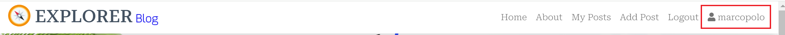
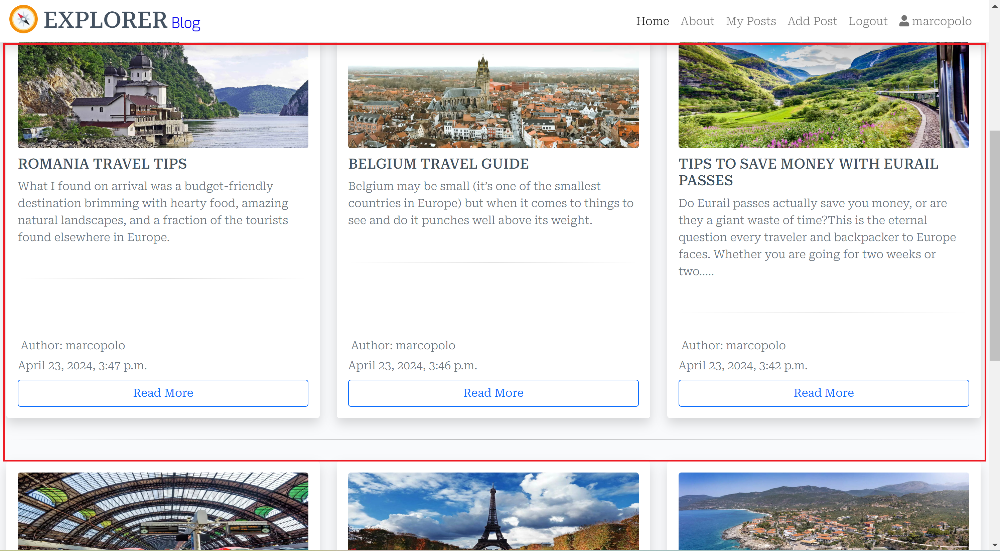
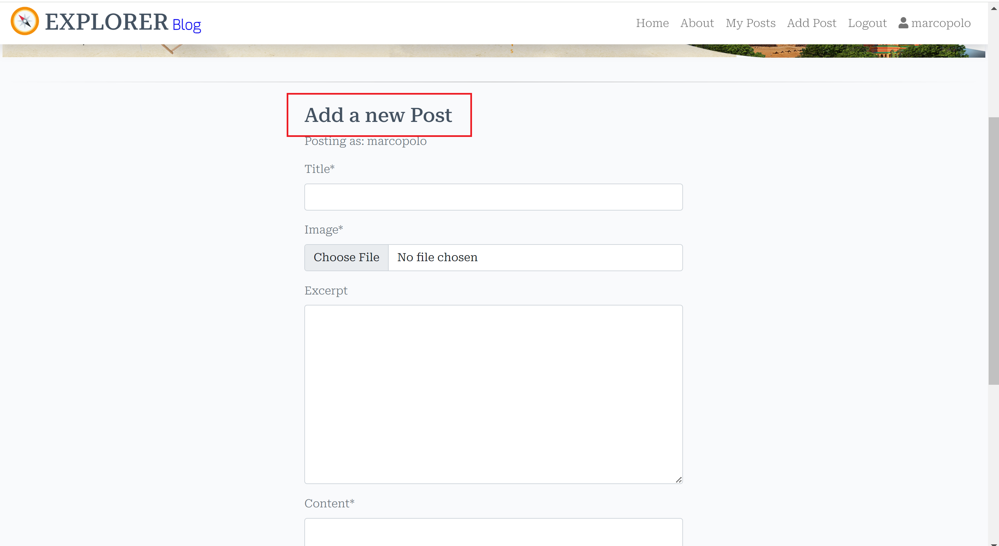
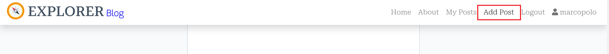
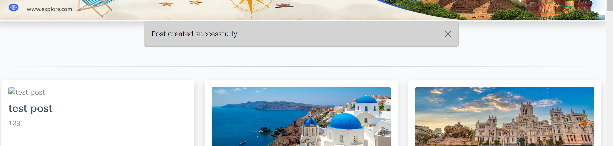
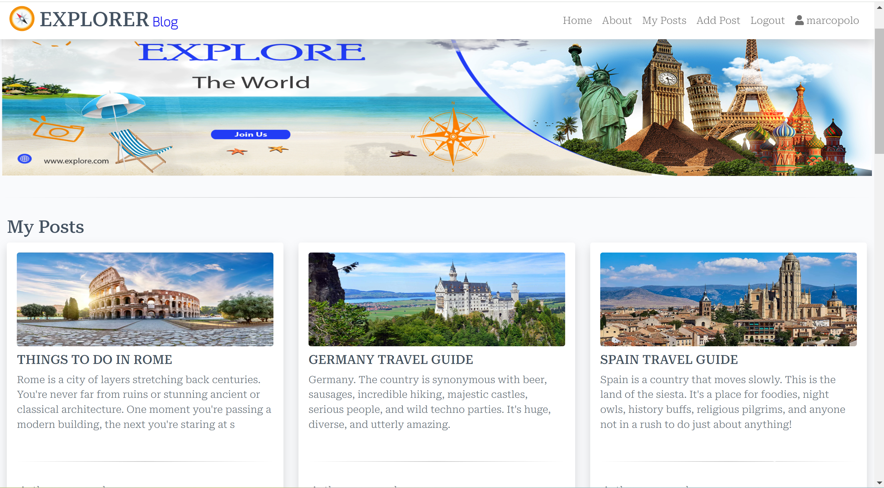
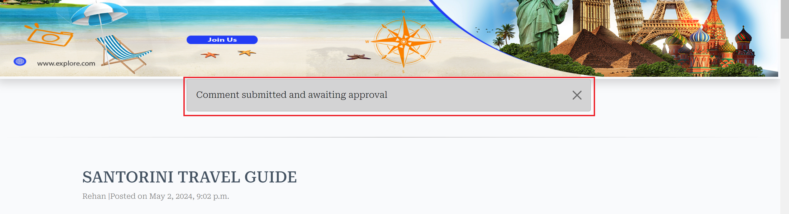

# Table of Contents
- [User Story Testing](#user-story-testing)
- [Validator Testing](#validator-testing)
  * [HTML](#html)
    + [Fixed Errors](#fixed-errors)
    + [Unfixed Errors](#unfixed-errors)
  * [CSS](#css)
  * [Javascript](#javascript)
  * [Python](#python)
  * [Lighthouse](#lighthouse)
- [Browser Testing](#browser-testing)
- [Device Testing](#device-testing)
- [Manual Testing](#manual-testing)
  * [Site Navigation](#site-navigation)
  * [Home Page](#home-page)
  * [Browse Posts Page](#browse-Posts-page)
  * [Post Detail Page](#Post-detail-page)
  * [Add Post Page](#add-Post-page)
  * [Update Post Page](#update-Post-page)
  * [Confirm Delete Post Page](#confirm-delete-Post-page)
  * [My Posts Page](#my-Posts-page)
  * [My Bookmarks Page](#my-bookmarks-page)
  * [My Meal Plan Page](#my-meal-plan-page)
  * [Django All Auth Pages](#django-all-auth-pages)
- [Bugs](#bugs)
  * [Fixed Bugs](#fixed-bugs)
    + [Overwrite Meal Plan Items](#overwrite-meal-plan-items)
    + [Required fields using Summernote extension submit with just whitespace entered](#required-fields-using-summernote-extension-submit-with-just-whitespace-entered)
    + [No Reverse Match Error](#no-reverse-match-error)
    + [Cloudinary Images not Displaying](#cloudinary-images-not-displaying)
    + [Footer not staying at bottom of screen](#footer-not-staying-at-bottom-of-screen)
  * [Unfixed bugs:](#unfixed-bugs-)

<small><i><a href='http://ecotrust-canada.github.io/markdown-toc/'>Table of contents generated with markdown-toc</a></i></small>

## User Story Testing

### EPIC | User Profile
*As a Site User I can register an account so that I can add/edit/delete my Posts and comment on and like or dislike other people's Posts and add Posts to my Explorer Blog.*

- A registration up button is immediately visible on the navigation Bar for the user to sign up to get started. When the user clicks the button they are taken to the sign up page.

- Once the user has registered an account they can perform all the actions listed above.

*As a Site User, I can login or logout of my account so that I can keep my account secure.*
- If the user has registered an account they can access the login and logout buttons in the My Account section of the Navbar. 

*As a Site User I can see my login status so that I know if I'm logged in or out.*
- Once the user has logged into their account their username displays on the Navbar beside a profile icon.

### EPIC | User Navigation
 *As a User I can immediately understand the purpose of the site so that I can decide if it meets my needs*

*As a user, I can intuitively navigate around the site so that I can find content*
- A navigation bar is visible on every page of the site which is fully responsive on different screen sizes.

*As a Site User, I can view a paginated list of Posts so that I can select a Post to view.*
- The Browse Posts page displays a paginated list of all Posts in the database with a status of published. 

*As a Site User, I can click on a post so that I can read the full Post, and view comments left by users.*
- Clicking anywhere inside the Post card will take you directly to that Post's detailed page which displays the full Post details. 

- A list of comments is displayed underneath the Post details.

- Like or dislike icons are displayed underneath the Post details.

### EPIC | Post Management
*As a Site User, I can view the posts and write a comment on Posts and like or dislike the Posts onto the app through an easy to use interface so that I can share my opinion  with other users.*
- Once the user has logged in, an Add Post Option is immediately available on the Navbar as a call to action for the user to add a Post. When the user clicks the button they are taken to the add Post form.

- The 'Add Post' button on the Nav bar is visible on every page.

- Once the user has filled out the form details they can choose to 'Submit Button' which adds the Post to the Posts page.

*As a Site User, I can edit and delete my  Posts that I have created so that I can easily make changes without having to start over.*
- If the logged in user is the Post author, edit and delete Post icon buttons will display on the Post detail page for each Post allowing the user to edit and delete their Posts.

*As a Site User, I can view my Posts so that I can see and manage all Posts I have created in the one location.*
- All the user's created Posts are available to see on the 'My Posts' page.

### EPIC | Post Interaction
*As a Site User, I can like or dislike  users' Posts, so can show my view about the Post.
- Each Post has like or dislike buttons right below the Post details, it show also number of likes or dislikes.

*As a Site User, I can comment on other people's Posts so I can give my feedback.*
- Each Post has a comment section where logged in users can leave comments on the Post.

### EPIC | Posts Management
*As a Site User, I can edit and delete comments that I have created so that I can easily make changes if I have made a mistake.*
- If the logged in user is the comment author, edit and delete icon buttons will display bellow the comment  allowing the user to edit or delete their comments.

### EPIC | Site Administration
*As a Site Administrator, I can create, read, update and delete Posts, and comments so that I can manage the app content*
-  Admins have full access to CRUD functionality for all Posts,and comments in the admin panel.

